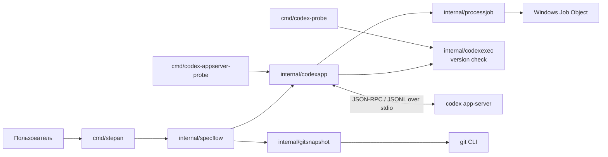
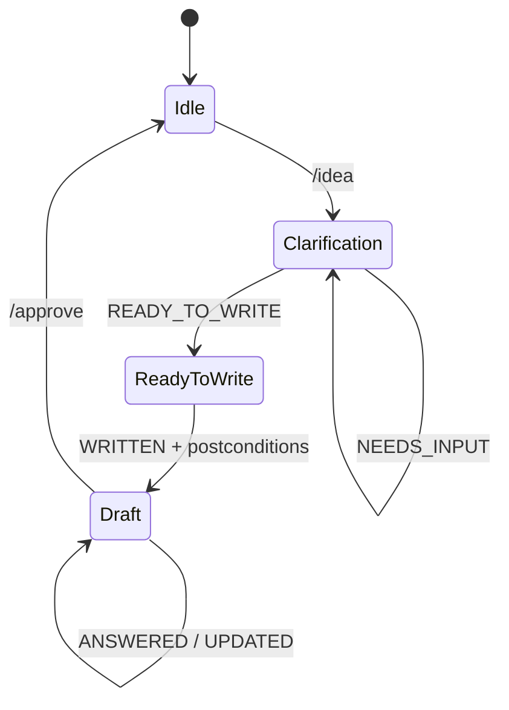

# ADR 0002: Текущий стек и архитектурный baseline

Статус: **предложено**

Дата: 2026-08-13

## Контекст

Перед выбором целевой архитектуры нужно зафиксировать уже реализованную систему.
Этот ADR описывает текущее состояние репозитория и служит baseline для следующих
архитектурных решений. Он не утверждает, что все перечисленные ограничения
должны сохраниться в целевой архитектуре.

## Решение

Текущая архитектура Stepan — локальный **модульный монолит** с одной основной
CLI-программой, синхронной машиной состояний workflow и инфраструктурными
адаптерами к Codex, Git и Windows API.

### Стек

| Область | Текущая технология |
|---|---|
| Язык и toolchain | Go `1.26.5` |
| Пользовательский интерфейс | Интерактивный terminal UI на `charm.land/huh/v2 v2.0.3` |
| Агентский runtime | Внешний `codex-cli 0.147.0`, `codex app-server --stdio` |
| IPC | JSON-RPC поверх UTF-8 JSONL в `stdin`/`stdout` |
| Контракты ответов | JSON Schema 2020-12 и строгая декодировка в Go |
| Репозиторий и artifacts | Локальная файловая система и Git CLI; спецификации в `docs/specs/` |
| Изоляция процессов | Windows Job Object; поддерживаемая платформа — Windows/amd64 |
| Тесты | `go test`, стандартный пакет `testing`, fake/replay App Server |

Единственная прямая runtime-зависимость приложения — `huh`; остальные
UI-библиотеки приходят транзитивно. Базы данных, серверного API, контейнерной
инфраструктуры и собственного model runtime нет.

### Компоненты и зависимости

Основной production-путь соблюдает направление зависимостей
`cmd/stepan → specflow → infrastructure`. Обратных импортов из инфраструктурных
пакетов в `specflow` нет.

- `cmd/stepan` — composition root, platform/terminal preflight и обработка
  завершения процесса.
- `internal/specflow` — прикладное ядро текущего `/idea` flow: машина состояний,
  prompts, JSON-схемы, правила размещения спецификаций и постусловия записи.
- `internal/codexapp` — lifecycle App Server, JSON-RPC transport, thread/turn,
  correlation, structured output и fail-closed approval policy.
- `internal/gitsnapshot` — неизменяющий настоящий index снимок Git-дерева,
  сравнение до/после turn и проверка write boundary.
- `internal/processjob` — завершение всего дерева дочерних процессов.
- `internal/codexexec` — legacy spike/evidence для `codex exec`; основной путь
  переиспользует из него только проверку версии Codex.
- `cmd/codex-probe` и `cmd/codex-appserver-probe` — диагностические программы,
  не входящие в пользовательский workflow.

Небольшие интерфейсы объявляются потребляющим пакетом `specflow` и служат швами
для тестирования. Общего provider API, workflow engine, DSL или registry нет.

### Управление состоянием и данными

`specflow.Controller` единолично меняет состояние flow. Один интерактивный
процесс лениво владеет одним App Server; каждая идея получает новый Codex
thread, turns выполняются последовательно.

Текущий источник истины разделён так:

- состояние диалога, thread/turn IDs и approvals живут только в памяти процесса;
- созданная спецификация сохраняется в `docs/specs/<spec-id>/`;
- фактические изменения и границы записи проверяются по Git, а не по сообщению
  агента;
- `.stepan/`, durable event log и resume в пользовательском пути пока не
  используются.

Durable approval manager существует в probe-коде `codexapp`, но текущий путь
`cmd/stepan → specflow.Session → codexapp.Runtime` использует turn-scoped
in-memory approvals.

### Инварианты текущего пути

- Stepan, а не Codex, выбирает переходы workflow.
- Свободный текст агента не меняет состояние: переход требует результата,
  валидного относительно схемы конкретного turn.
- Turn по умолчанию read-only и без сети; write-turn получает один writable
  root каталога текущей спецификации.
- После записи отдельно проверяются structured status, наличие
  `specification.md` и Git write boundary.
- Ошибка протокола, approval или containment закрывает текущий flow без
  автоматического retry.
- Закрытие runtime завершает всё дерево App Server через Job Object.

## Последствия

- Архитектура проста для локального последовательного MVP: один процесс, один
  исполняемый файл и явные package boundaries.
- Доменный workflow пока связан с конкретным `specflow`; добавление новых flow
  потребует нового решения, но преждевременная универсальная абстракция не
  вводится.
- Надёжность строится на внешней проверке Git/OS и строгих контрактах, а не на
  доверии к тексту агента.
- Текущий runtime нельзя считать восстанавливаемым или воспроизводимым:
  состояние эфемерно, а используется пользовательский профиль Codex.
- Несмотря на `job_other.go`, пользовательский executable намеренно допускает
  только Windows/amd64.

## Отложено до выбора целевой архитектуры

- модель нескольких workflow и их общих состояний;
- граница поддержки других agent CLI;
- durable state, event log, resume и recovery;
- изоляция Codex profile и source-blind roles;
- Linux/macOS;
- параллельное выполнение и workspaces;
- необходимость service mode, БД или сетевого API.

Ни один из этих пунктов не считается обязательным только потому, что он здесь
перечислен; отдельное решение требуется при появлении подтверждённой потребности.

## Критерии пересмотра

ADR обновляется, если меняется основной executable, направление package
dependencies, способ запуска агента, модель состояния или поддерживаемая
платформа. Целевые решения оформляются отдельными ADR и ссылаются на этот
baseline.

## Основания

- [`go.mod`](../../go.mod)
- [`cmd/stepan`](../../cmd/stepan/)
- [`internal/specflow`](../../internal/specflow/)
- [`internal/codexapp`](../../internal/codexapp/)
- [`internal/gitsnapshot`](../../internal/gitsnapshot/)
- [`internal/processjob`](../../internal/processjob/)
- [ADR 0001](0001-codex-app-server-containment.md)
- [Спецификация итерации 1](../specs/iteration-1/specification.md)
