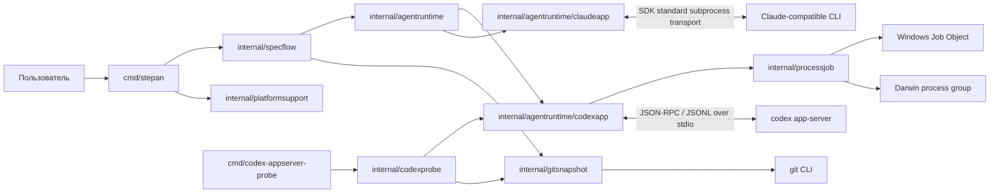
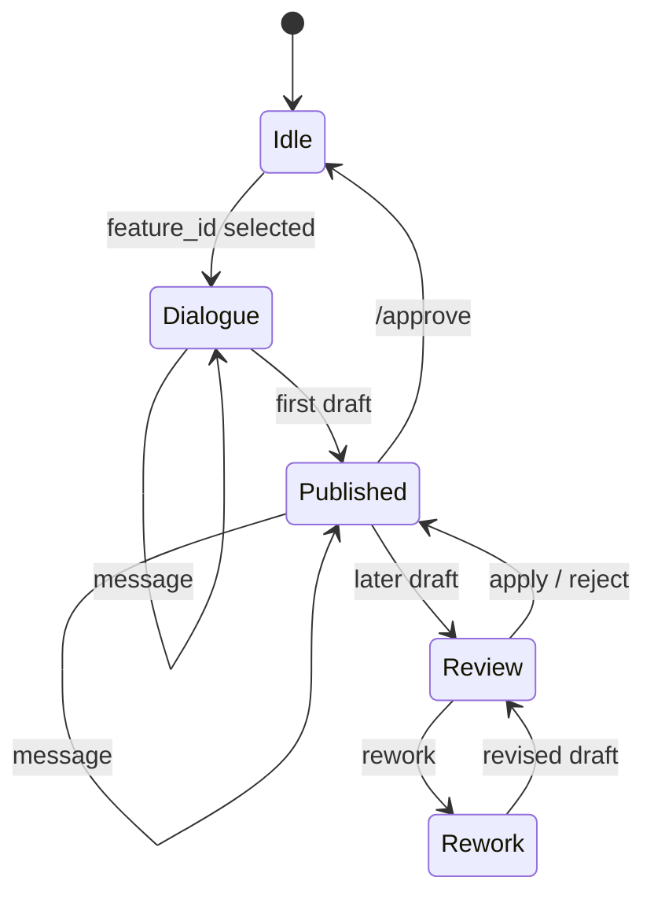

# ADR 0002: Текущий стек и архитектурный baseline

Статус: **предложено**

Дата: 2026-08-13

Обновлено: 2026-08-29: intent dialogue использует thread-scoped configuration
с read-only workspace и одним внешним writable artifact root.

Разделы о provider boundary и Claude дополняет [ADR 0004](0004-claude-cli-runtime.md).

## Контекст

Перед выбором целевой архитектуры нужно зафиксировать уже реализованную систему.
Этот ADR описывает текущее состояние репозитория и служит baseline для следующих
архитектурных решений. Он не утверждает, что все перечисленные ограничения
должны сохраниться в целевой архитектуре.

## Решение

Текущая архитектура Stepan — локальный **модульный монолит** с одной основной
CLI-программой, синхронной машиной состояний workflow и инфраструктурными
адаптерами к Codex, Git и платформенным API управления процессами.

### Стек

| Область | Текущая технология |
|---|---|
| Язык и toolchain | Go `1.26.5` |
| Пользовательский интерфейс | Интерактивный terminal UI на `charm.land/huh/v2 v2.0.3` |
| Агентский runtime | Codex App Server; Claude Code-совместимый CLI через SDK v0.6.22 |
| IPC | JSON-RPC поверх UTF-8 JSONL в `stdin`/`stdout` |
| Контракты ответов | JSON Schema 2020-12 и строгая декодировка в Go |
| Репозиторий и artifacts | Локальная файловая система и Git CLI; спецификации в `docs/changes/features/` |
| Изоляция процессов | Windows Job Object или Darwin process group; Windows/amd64 и macOS/arm64 |
| Тесты | `go test`, `testing`, Arch-Go для графа импортов, fake/replay App Server |

Прямые UI/runtime-зависимости приложения — `huh` и TTY detector `x/term`;
остальные UI-библиотеки приходят транзитивно. Базы данных, серверного API,
контейнерной инфраструктуры и собственного model runtime нет.

### Компоненты и зависимости

Основной production-путь соблюдает направление зависимостей
`cmd/stepan → specflow → infrastructure`. Обратных импортов из инфраструктурных
пакетов в `specflow` нет.

- `cmd/stepan` — composition root, provider/CLI preflight, platform/terminal
  preflight и обработка завершения процесса.
- `internal/specflow` — прикладное ядро `/feature`: intent dialogue, строгие
  `message | draft` contracts, feature storage, append-only journal и review.
- `internal/agentruntime/codexapp` — version preflight и lifecycle App Server,
  JSON-RPC transport, thread/turn, correlation, structured output и общий
  fail-closed approval evaluator.
- `internal/agentruntime` — provider-neutral thread configuration: bootstrap,
  schema, read-only workspace, один внешний artifact root и lifecycle.
- `internal/agentruntime/claudeapp` — Claude SDK adapter с exact tool allowlist и
  thread-scoped filesystem permission callback; не управляет деревом процессов.
- `internal/gitsnapshot` — неизменяющий настоящий index снимок Git-дерева,
  сравнение до/после turn и проверка write boundary.
- `internal/codexprobe` — диагностический App Server flow, replay artifacts и
  durable approval manager с Git candidate snapshot.
- `internal/processjob` — завершение всего дерева дочерних процессов.
- `internal/platformsupport` — единая матрица поддерживаемых OS/architecture.
- `cmd/codex-appserver-probe` — диагностическая программа, не входящая в
  пользовательский workflow.

Небольшие интерфейсы объявляются потребляющим пакетом `specflow` и служат швами
для тестирования. Общего provider API, workflow engine, DSL или registry нет.

### Управление состоянием и данными

`specflow.Controller` единолично меняет состояние flow. Один интерактивный
процесс лениво владеет одним App Server; каждая идея получает новый Codex
thread, turns выполняются последовательно.

Текущий источник истины разделён так:

- состояние диалога, thread/turn IDs и approvals живут только в памяти процесса;
- Stepan публикует `intent.md` и append-only `mem-log.md` в
  `docs/changes/features/<dated-feature-id>/`; агент пишет только временный
  draft во внешнем artifact root;
- revision применяет ровно байты, для которых был показан diff: перед записью
  повторно проверяется hash draft;
- `.stepan/`, durable event log и resume в пользовательском пути пока не
  используются.

Durable approval manager существует в `codexprobe`, но текущий путь
`cmd/stepan → specflow.Session → codexapp.Runtime` использует thread-scoped
in-memory policy и turn-local evidence для approval.

### Инварианты текущего пути

- Stepan, а не Codex, выбирает переходы workflow.
- Свободный текст агента не меняет состояние: переход требует результата,
  валидного относительно схемы конкретного turn.
- Конфигурация schema и доступа фиксируется при создании thread; `RunTurn`
  принимает только новый пользовательский текст. Workspace read-only, а
  основной intent thread может писать только в один внешний artifact root.
- Агент возвращает строгий `message | draft` envelope; Stepan сам публикует
  `intent.md`, журналирует решения и показывает unified diff для revision.
- `/approve` и отмена журналируются, закрывают thread и удаляют только
  внешний artifact root; resume не предусмотрен.
- Ошибка протокола, approval или containment закрывает текущий flow без
  автоматического retry.
- Закрытие Codex runtime завершает контролируемое дерево App Server через
  платформенный supervisor: Job Object на Windows или process group на macOS.
  Claude runtime ограничен SDK `Disconnect`; принятый риск описан ADR 0004.

## Последствия

- Архитектура проста для локального последовательного MVP: один процесс, один
  исполняемый файл и явные package boundaries.
- Доменный workflow пока связан с конкретным `specflow`; добавление новых flow
  потребует нового решения, но преждевременная универсальная абстракция не
  вводится.
- Надёжность строится на внешней проверке Git/OS и строгих контрактах, а не на
  доверии к тексту агента.
- Текущий runtime нельзя считать восстанавливаемым или воспроизводимым:
  состояние эфемерно, а используется пользовательский профиль Codex.
- Пользовательский executable допускает Windows/amd64 и macOS/arm64. На macOS
  process group не удерживает потомков, которые намеренно вызвали `setsid` или
  сменили группу; это ограничение принято ADR 0003.

## Отложено до выбора целевой архитектуры

- модель нескольких workflow и их общих состояний;
- граница поддержки других agent CLI;
- durable state, event log, resume и recovery;
- изоляция Codex profile и source-blind roles;
- Linux и Intel Mac;
- параллельное выполнение и workspaces;
- необходимость service mode, БД или сетевого API.

Ни один из этих пунктов не считается обязательным только потому, что он здесь
перечислен; отдельное решение требуется при появлении подтверждённой потребности.

## Критерии пересмотра

ADR обновляется, если меняется основной executable, направление package
dependencies, способ запуска агента, модель состояния или поддерживаемая
платформа. Целевые решения оформляются отдельными ADR и ссылаются на этот
baseline.

## Основания

- [`go.mod`](../../go.mod)
- [`cmd/stepan`](../../cmd/stepan/)
- [`internal/specflow`](../../internal/specflow/)
- [`internal/agentruntime/codexapp`](../../internal/agentruntime/codexapp/)
- [`internal/codexprobe`](../../internal/codexprobe/)
- [`internal/gitsnapshot`](../../internal/gitsnapshot/)
- [`internal/processjob`](../../internal/processjob/)
- [ADR 0001](0001-codex-app-server-containment.md)
- [ADR 0003](0003-macos-process-containment.md)
- [ADR 0004](0004-claude-cli-runtime.md)
- [Спецификация итерации 1](../changes/features/iteration-1/specification.md)
