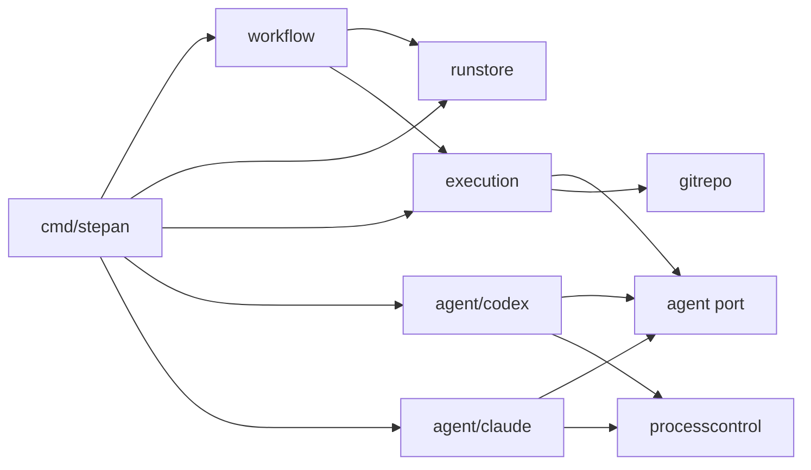
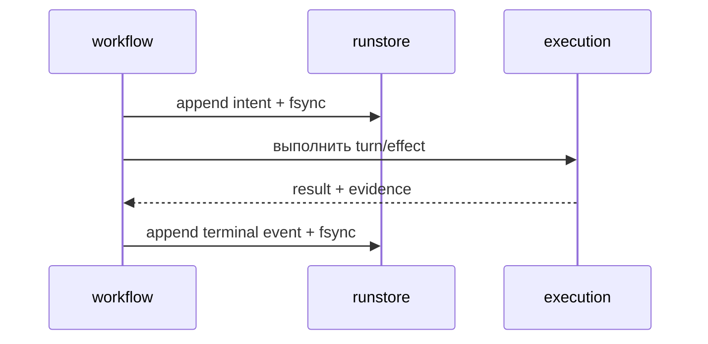

# Architecture Spine — Stepan

Stepan остаётся локальным CLI, который ведёт воспроизводимый workflow поверх внешних агентских CLI. Этот документ задаёт минимальные границы, общие для следующих функций; детали конкретной функции принадлежат её спецификации.

Для нового кода решения ниже имеют приоритет над архитектурными деталями текущего MVP в roadmap и ADR 0001: `state.json`, exact pin Codex, Windows-only boundary и отсутствие общего runner. Порядок продуктовых функций roadmap сохраняется; действующий MVP не считается мигрированным, пока новые инварианты не реализованы и не проверены.

## Design Paradigm

Модульный монолит на Go с лёгкими ports and adapters. Пакеты группируются по возможностям продукта, а интерфейсы появляются только на реальных сменяемых или тестовых границах. Общих слоёв `ports`, `adapters`, `services` и собственного workflow-фреймворка нет.



`cmd/stepan` — единственный composition root: он создаёт объекты и связывает реализации. Прямые импорты между capability-пакетами следуют диаграмме; никакой другой пакет не конструирует конкретный agent adapter или OS process controller.

## Invariants & Rules

### AD-1. Границы модульного монолита

- **Binds:** `cmd/stepan`, все пакеты `internal/*`.
- **Prevents:** циклические зависимости, глобальные технические слои и преждевременную микросервисную декомпозицию.
- **Rule:** `workflow` не импортирует конкретные агентские адаптеры, формат хранения, Git-реализацию или OS API. Конкретные реализации связывает только `cmd/stepan`. Новый интерфейс допустим при второй реализации либо когда он является минимальной тестовой границей.

### AD-2. События — единственный долговечный источник состояния run

- **Binds:** `.stepan/runs/<run-id>/events.jsonl`, восстановление и отображение run.
- **Prevents:** расхождение между «текущим состоянием» и историей выполнения.
- **Rule:** служебное состояние workflow восстанавливается полным replay последовательного журнала; утверждённые проектные артефакты и Git остаются самостоятельными durable данными. Каждая запись — один UTF-8 JSON object на одной строке с завершающим LF и полями `schema_version`, `run_id`, `seq`, `time`, `type`, `payload`; `seq` строго возрастает. Неизвестные версия/тип, разрыв последовательности или повреждённая запись останавливают replay. Игнорировать как torn write можно только последнюю строку без LF. Commit записи — успешные append и `fsync`. `runstore` держит эксклюзивный OS lock на run всё время записи и отказывает второму writer. Snapshot добавляется только после измеренной необходимости.

### AD-3. Большие данные являются evidence, а не событиями

- **Binds:** prompts, outputs, логи и иные артефакты run.
- **Prevents:** неограниченный рост событий и незаметную подмену артефактов.
- **Rule:** большие данные хранятся файлами внутри run, а событие содержит относительный путь и SHA-256. Evidence сначала пишется во временный файл, проходит `fsync`, атомарно публикуется внутри run и фиксирует directory metadata подходящим platform primitive; только после этого committed event может на него сослаться. Stepan не перезаписывает опубликованное evidence и проверяет hash при каждом чтении; отсутствие файла или несовпадение SHA-256 останавливает replay/effect fail-closed. Секреты и credentials не записываются ни в события, ни в evidence.

### AD-4. Workflow владеет состоянием и порядком эффектов

- **Binds:** каждый встроенный workflow и любой внешний эффект.
- **Prevents:** скрытые переходы состояния из UI, адаптеров или инфраструктуры и невосстановимые частично выполненные действия.
- **Rule:** workflow реализован явной Go state machine и только он выпускает доменные события. До изменения кода обязательны явные `approve spec` и `approve plan`; молчание не является согласием, материальные вопросы задаются по одному. Утверждённые spec/plan сохраняются в проект и planning commit; их изменение инвалидирует approval и зависимые результаты. До внешнего действия workflow синхронно фиксирует intent, затем выполняет effect и фиксирует terminal event. После сбоя recovery сопоставляет незавершённый intent с Git и evidence. Общий engine/DSL не создаётся, пока минимум два реальных workflow не докажут одинаковую механику.



### AD-5. У всех поддерживаемых агентов один обязательный контракт

- **Binds:** `agent.Runner` и встроенные адаптеры Codex CLI и Claude Code.
- **Prevents:** условную бизнес-логику по провайдеру и тихую потерю гарантий.
- **Rule:** контракт содержит только `RunTurn(ctx, request)` и `Close()`. Request передаёт optional opaque `SessionRef`, абсолютный `workspaceRoot`, prompt, output schema в версионированном Stepan-подмножестве JSON Schema draft-07 и `AccessPolicy`; result возвращает `SessionRef`, structured output и `EvidenceRef`. `nil SessionRef` начинает сессию, ненулевой пытается продолжить её. Адаптер, который не может выполнить весь контракт или policy, отклоняет turn до запуска.

### AD-6. Сессия агента не является состоянием продукта

- **Binds:** resume, retry и handoff между ролями.
- **Prevents:** зависимость восстановления run от скрытого контекста конкретного CLI.
- **Rule:** каждая роль имеет отдельную opaque session. Роли обмениваются только committed events, evidence и явно собранными prompt inputs. При потере session workflow может начать новую из durable inputs и фиксирует retry; `SessionRef` — только указатель для оптимизации resume.

### AD-7. Ошибка классифицируется адаптером, решение принимает workflow

- **Binds:** все результаты `RunTurn`.
- **Prevents:** provider-specific retry policy и утечку деталей CLI в workflow.
- **Rule:** общий набор kinds: `unavailable`, `session_lost`, `policy_violation`, `invalid_output`, `canceled`, `failed`. Адаптер добавляет provider code/message в evidence; workflow решает retry, новую session или остановку.

### AD-8. Execution envelope применяет политику до запуска и проверяет результат

- **Binds:** каждый агентский turn.
- **Prevents:** запуск с неисполненной политикой доступа и незамеченные записи вне разрешённого набора.
- **Rule:** `execution` — единственный владелец enforcement; адаптер только переводит политику в возможности CLI. `AccessPolicy` — закрытый версионированный Stepan-контракт с явными filesystem read/write scopes, network mode/allowlist и external-effect permissions; всё неразрешённое запрещено, provider-specific поля недопустимы. Turn проходит через durable intent, подготовленный workspace, policy enforcement, agent runner, независимую Git/evidence-проверку и terminal event. Ограничения чтения и сети должны быть превентивными; post-check для них недостаточен. Source-blind роль запускается с security principal/sandbox, которому исходники недоступны; sibling-каталог и Git worktree сами по себе такой границей не являются. Допустимые записи проверяются также по Git diff.

### AD-9. OS-зависимое управление процессами изолировано

- **Binds:** запуск, cancel, timeout и cleanup дерева процессов агента.
- **Prevents:** проверки `runtime.GOOS` в workflow и адаптерах, а также оставшиеся дочерние процессы.
- **Rule:** один пакет `processcontrol` имеет build-tagged реализации: Windows Job Object и macOS POSIX process group/signals. Процесс запускается прямым argv без промежуточного shell. Отмена `context.Context` завершает всё дерево turn. На macOS daemonization/выход из process group запрещены политикой; агент, для которого это нельзя обеспечить и проверить, не поддерживается без дополнительного containment. Платформа считается поддержанной только после живых lifecycle/cancel/cleanup тестов.

### AD-10. Workspace всегда явный

- **Binds:** execution, агенты и Git-проверки.
- **Prevents:** зависимость от process-global working directory и препятствие будущему параллелизму.
- **Rule:** каждый turn получает абсолютный `workspaceRoot`; агент изменяет подготовленный workspace напрямую, без общего patch-протокола. Сначала обычные роли выполняются последовательно в текущем checkout, source-blind роль — в отдельной директории. Worktree manager и разрешение конфликтов добавляются только вместе с реальным параллельным выполнением.

### AD-11. Версии внешних CLI проверяются во время запуска

- **Binds:** discovery и запуск агентских CLI.
- **Prevents:** пересборку Stepan для каждой новой версии агента и молчаливую работу с несовместимым протоколом.
- **Rule:** для адаптера задаётся минимальная поддерживаемая версия. Ниже минимума — отказ. Любой tuple CLI version × OS × CPU architecture, которого нет в живой матрице, получает warning и durable отметку `unverified`, но при версии не ниже minimum запуск разрешён. Фактический tuple и статус проверки фиксируются до первого turn роли. Валидация протокола и structured output всегда fail-closed, независимо от версии.

### AD-12. Совместимость доказывается на трёх уровнях

- **Binds:** изменения workflow, адаптеров и списка поддерживаемых платформ/версий.
- **Prevents:** объявление поддержки на основании одной документации или моков.
- **Rule:** state machines тестируются с fake `Runner`; общий контракт адаптеров — герметичными conformance fixtures; совместимость — живой матрицей agent × exact CLI version × OS. Статус `verified` принадлежит только точному tuple из этой матрицы; новая версия, архитектура CPU или OS остаётся `unverified`, пока не пройдёт её полностью. Claude Code до первого такого прогона проектируется по официальной документации, но не объявляется проверенным.

### AD-13. Контракты ролей принадлежат workflow

- **Binds:** role prompt, output schema, access policy и provider-specific настройки.
- **Prevents:** скрытое изменение поведения внутри адаптера и разные смыслы одной роли у разных агентов.
- **Rule:** workflow владеет каноническими prompt, JSON Schema и policy роли. Адаптер семантически нейтрален. Provider-specific инструкции допустимы только как явный версионированный execution profile с fingerprint; назначенный роли runner/version/profile фиксируется до её первого turn, без неявного fallback.

### AD-14. Адаптеры встроены в один локальный процесс

- **Binds:** сборка и deployment Stepan.
- **Prevents:** публичный plugin ABI, сетевой control plane и операционную сложность до подтверждённой необходимости.
- **Rule:** адаптеры компилируются в Stepan и регистрируются в `cmd/stepan`. Продукт остаётся нативным локальным CLI, управляющим установленными пользователем agent CLI; daemon, database и прямой model API требуют отдельного архитектурного решения. Поддерживаются только локальные обратимые задачи без production credentials и необратимых внешних эффектов; остальные завершаются `BLOCKED`, а не частично поддерживаемым запуском.

### AD-15. Acceptance и commit привязаны к неизменному candidate

- **Binds:** deterministic checks, verifier, rework, task commit и final verification.
- **Prevents:** commit непроверенного состояния и evidence от другого набора файлов.
- **Rule:** новый run начинается на чистом tree; агент не меняет HEAD и не создаёт commit, verifier не пишет файлы. Stepan строит полный будущий commit tree через изолированный временный Git index, не меняя настоящий index/refs/working tree; candidate snapshot равен `HEAD OID + tree OID`. Checks, read-only verification и evidence относятся к этому snapshot, а любое изменение его OID инвалидирует результат. После bounded rework только Stepan создаёт локальный commit при `PASS`, никогда не делает push, а после всех задач запускает final verification всего плана. При неоднозначном recovery изменения сохраняются без commit и run безопасно останавливается с явным маршрутом продолжения.

## Consistency Conventions

- Provider-specific request/result/event types остаются внутри `internal/agent/<provider>`.
- Durable paths всегда относительны каталогу run; runtime paths передаются абсолютными и в нативном формате OS.
- Порядок событий определяется только `seq`; wall-clock `time` не используется для упорядочивания.
- Один process владеет записью run; конкурентная запись в один журнал не поддерживается.
- Ошибки на trust boundaries содержат контекст, но не секреты и не полный чувствительный prompt.

## Stack

Версии Go и `huh` ниже отражают текущий `go.mod`, а не становятся бессрочными архитектурными pins; их обновление проходит обычную проверку сборки и тестов.

| Name | Version | Роль и ограничение |
|---|---|---|
| Go | current go.mod: 1.26.5 | Один нативный binary; standard library прежде новых зависимостей |
| `charm.land/huh/v2` | current go.mod: 2.0.3 | Только интерактивный ввод; доменная логика остаётся вне UI |
| Codex CLI | minimum 0.147.0 | `0.147.0` — transport baseline на Windows/amd64, но не `verified` для нового общего контракта |
| Durable state | event schema v1 | JSON Lines + evidence files + SHA-256; один writer |

Claude Code — целевой adapter, спроектированный по документации; его minimum и первый `verified` tuple будут установлены живым conformance-прогоном.

## Structural Seed

Создавать пакеты нужно по мере первой функции, а не заранее. Минимальная целевая карта:

```text
cmd/stepan/                 composition root и CLI
internal/workflow/          state machines и контракты ролей
internal/agent/             общий Runner, request/result/error kinds
internal/agent/codex/       адаптер Codex CLI
internal/agent/claude/      адаптер Claude Code
internal/execution/         execution envelope и policy orchestration
internal/runstore/          events.jsonl, evidence и replay
internal/gitrepo/           snapshot/diff/write-set verification
internal/processcontrol/    Windows/macOS process tree lifecycle
```

```text
.stepan/runs/<run-id>/
├── events.jsonl
├── evidence/
└── workspaces/             только для изолированных materializations
```

## Deferred Decisions

- Способ назначения агента роли: статический профиль, выбор оператора или автоматический routing. До решения фактическое назначение всё равно фиксируется до первого turn.
- Политика пользовательских расширений: чистый профиль; allowlist skills при отключённых hooks/MCP/skill shell execution; либо явно ослабленный inherited profile. Возможность точного enforcement должна быть проверена отдельно для каждого CLI. Это release gate для функции execution profiles; до решения новый режим наследования пользовательских расширений не выпускается, а текущий Codex baseline остаётся описан ADR 0001 без превращения в целевой default.
- Parallel execution: per-task worktrees, блокировки, конфликты и координация. Добавлять, когда появится первая пара реально параллельных задач.
- Второй storage backend и интерфейс хранилища. Добавлять только при появлении второго backend; SQLite не является текущим решением.
- Snapshot журнала событий. Добавлять при измеренной проблеме replay.
- Общий workflow engine/DSL. Рассматривать после двух реализованных workflow с доказанным повторением.
- Внешний adapter/plugin protocol. Рассматривать при первой необходимости стороннего адаптера без пересборки.
- Minimum и verified range Claude Code, точные флаги запуска и ограничения sandbox — после первого живого conformance-прогона на каждой целевой OS.
- Linux и иные платформы — после Windows и macOS тем же контрактом `processcontrol` и живой матрицей.
