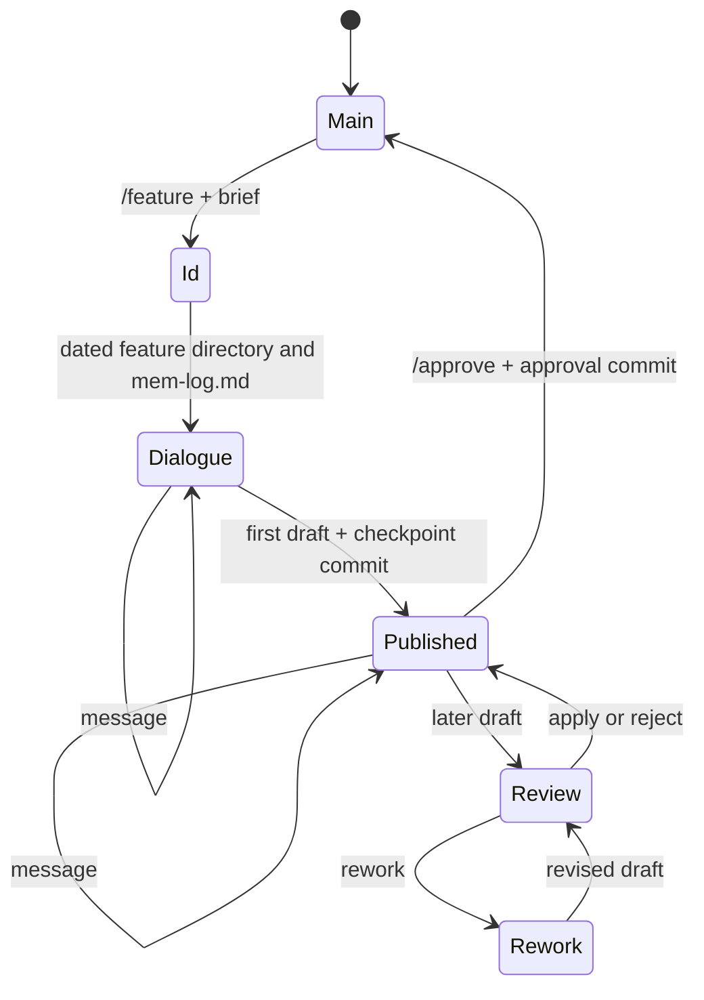

# Intent flow `/feature`

`/feature` ведёт один продолжительный диалог об intent — проблеме, наблюдаемом
результате, границах scope и существенных ограничениях. Он не создаёт
техническую спецификацию, дизайн или план реализации; устойчивый intent draft
и его approval сохраняются отдельными commits.



Stepan first asks a small read-only request for a semantic `feature_id`, then
creates `docs/changes/features/YYYY-MM-DD-<feature-id>/`. A collision receives
the first free suffix (`-2`, `-3`, …). Before the main dialogue starts the
directory contains `mem-log.md` with the literal brief and ID event.

The main thread has one immutable policy for its whole lifetime: Git workspace
is read-only; a unique external artifact root is read-write; all other paths,
network, and commands are denied. The agent writes only
`<artifact-root>/intent.md`; Stepan is the only writer of project `intent.md`
and `mem-log.md`.

Agent turns return exactly one of:

```json
{"kind":"message","message":"…","decisions":[]}
{"kind":"draft","decisions":[]}
```

The first valid draft is published immediately and saved by a checkpoint
commit. Later drafts display a unified
diff and wait for `apply`, `reject`, or `rework`; a rework comment returns to
the same thread. `/approve` is available only after publication. It appends the
approval event, creates an approval commit, closes the flow, deletes its
artifact root, and returns to the main prompt. Interrupted and failed flows
retain project artifacts but are not resumed automatically.

## Agent review rounds

Specification and implementation plan reviews are user-driven. Every
`/review` starts exactly one reviewer round, writes a new numbered report such
as `reviews/spec-002.md`, creates a checkpoint commit, and stops for the user.
There is no automatic follow-up review.

`/apply` records the accepted findings in its own checkpoint commit and invokes
the author once. If the author publishes a corrected document, that revision is
checkpointed and the flow waits for `/review` or `/approve`. If the author needs
a new material choice, ordinary text remains routed to the author until the
corrected document is published.
