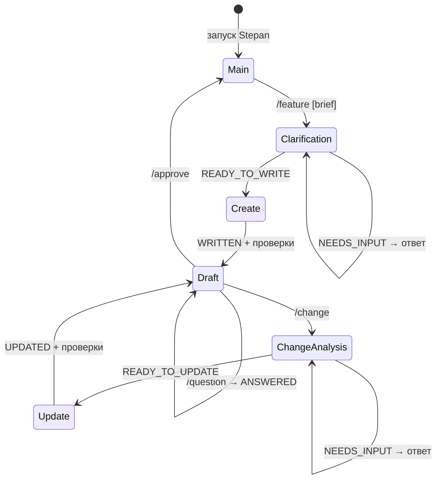

# Протокол flow `/feature`

Этот документ описывает фактическое поведение текущей интерактивной команды
`/feature`. Она помогает подготовить и согласовать спецификацию, но не реализует
задачу, не создаёт Git commit и не удаляет неутверждённые файлы.

## Запуск

`stepan` запускается из Git working tree и ждёт команду в терминале. По
умолчанию он использует `codex` из `PATH`; совместимый Claude CLI выбирается
явно:

```text
stepan --agent claude --agent-cli <абсолютный-путь-к-cli>
```

Поддерживаются только интерактивные stdin и stdout. Команда `/feature` принимает
весь текст после первого пробела как literal brief: кавычки и обратные слеши не
интерпретируются. Варианты запуска:

```text
/feature Добавить экспорт отчёта в CSV
/feature
```

Во втором случае Stepan запросит идею отдельной строкой. Неизвестная команда
показывает ошибку и возвращает к главному приглашению.

## Последовательность работы



1. Stepan открывает отдельный диалог агента для каждой команды `/feature`.
   Сначала агент читает релевантные файлы репозитория и в режиме без записи
   задаёт не более одного существенного уточняющего вопроса за turn. Вопросы
   относятся только к решениям, которые влияют на поведение, границы или
   критерии приёмки.
2. Когда данных достаточно, агент возвращает `READY_TO_WRITE` и `feature_id`.
   Stepan проверяет ID и создаёт первый черновик отдельным turn с доступом на
   запись. Успехом считается только наличие файла
   `docs/changes/features/<feature-id>/specification.md` и успешные проверки после записи.
3. Для созданного черновика Stepan показывает путь и ждёт одно из действий:
   `/approve`, `/question` или `/change`.
4. `/question` принимает текст вопроса и отвечает по текущей спецификации в
   режиме без записи. Затем пользователь снова выбирает действие для того же
   черновика.
5. `/change` принимает предложение изменения. Агент либо задаёт один
   дополнительный вопрос, либо подтверждает готовность к обновлению; во втором
   случае Stepan запускает write-turn и показывает тот же путь к обновлённому
   черновику.
6. `/approve` проверяет, что текущий `specification.md` существует и является
   обычным файлом, завершает flow и возвращает к главному приглашению. Это
   только явное подтверждение в памяти процесса: файл не меняется, маркер
   approval и Git commit не создаются.

Диалог и создаваемая спецификация ведутся на языке первоначального brief, если
пользователь явно не попросил другой язык.

## Контракт ответов агента

Каждый turn обязан вернуть валидный JSON, соответствующий своему этапу. Текст
ответа сам по себе не меняет состояние flow.

| Этап | Допустимый `status` | Обязательные поля |
| --- | --- | --- |
| Первичное уточнение | `NEEDS_INPUT` | непустой `message`, пустой `feature_id` |
| Первичное уточнение | `READY_TO_WRITE` | валидный `feature_id`, пустой `message` |
| Создание черновика | `WRITTEN` | — |
| Вопрос по черновику | `ANSWERED` | непустой `message` |
| Анализ изменения | `NEEDS_INPUT` | непустой `message` |
| Анализ изменения | `READY_TO_UPDATE` | — |
| Обновление черновика | `UPDATED` | — |

`feature_id` содержит от 1 до 64 символов `[a-z0-9-]` и не может быть именем
зарезервированного Windows device. Невалидный structured output либо ошибка
turn завершают текущий flow; автоматического повторного запуска или
восстановления диалога нет.

## Границы записи и завершение

До create/update turn агент имеет read-only policy. В write-turn ему разрешено
изменять только каталог текущей спецификации `docs/changes/features/<feature-id>/`. Stepan
сравнивает состояние Git working tree до и после записи, проверяет containment
пути и наличие `specification.md`. Если обнаружена запись вне разрешённого
каталога или нарушена любая постпроверка, flow завершается с ошибкой; Stepan не
откатывает и не удаляет частично созданные файлы.

Runtime агента стартует лениво при первой `/feature` и переиспользуется для
следующих flow в том же процессе, но каждый flow получает новый thread. Ошибка
runtime закрывает его: следующая `/feature` создаст новый runtime и новый thread.
`Ctrl+C` прерывает активную работу, закрывает runtime и завершает Stepan с
кодом 130. Незавершённые черновики остаются на диске и после перезапуска не
возобновляются автоматически.
